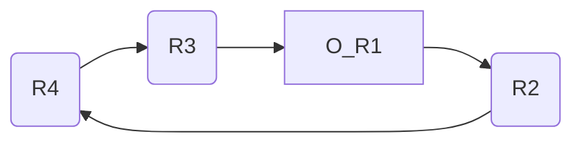

## 12-5 W12D1

### Coherence vs Consistency

e.g. cache coherence

多核中 cache 共享数据

```
PA: 
A = 0
A = 1
if (B == 0) kill PB

PB:
B = 0
B = 1
if (A == 0) kill PA
```

PA 和 PB 在分布式中可能同时被 kill!

但从 consistency 的角度来看，对 PA 来说：A = 1 -> kill B -> B = 1

对 PB 来说：B = 1 -> kill A -> A = 1

“矛盾”：两个人看到事情发生的顺序不同，违背 consistency

“大多数书不一起提这两个，各讲各的”

```
not coherence: 在一个小说里前面说一个桌子是蓝色的，后面说它是红色的      "错的"
not consistency: 在一个小说里对一个东西前面用英文，后面用德语，再后面用西班牙语......  ”没错，但是。。。“
```

### spin lock

one of locks in OS

Transactional Memory: ATM 机取款，输完金额密码，显示已经扣钱但还没取款时断电。再启动，验证身份后，要么继续吐钞票，要么余额退回。

上锁的目的：提供 “exclusive" 排他性。（高铁上卫生间）

遇到上锁：

- 一直尝试直到锁解除
- 先做别的事，想起来再尝试锁

```
while (1==lock); // 等待解锁
```

假设 A, B 都在等，C 把 lock 置为 0 后。

多核下，A, B 可能同时解除 while 往下。

读和写，作为一次原子操作不能保证。

解决：LL/SC (load linked/store conditional)

LL：从内存地址中读取，并对内存保留

SC：如果内存有保留就写入，否则返回错误（表明在 LL 之后 SC 之前这块内存没有被动过）

保留手段：LL 后把内存地址存在 lr 寄存器内，在 SC 时检查内存地址是否与 lr 一致，成功后清空 lr

如果要交换寄存器 R4 和 内存中 O(R1) 地址的值：

- 将 R4 的值取到 R3
- 将 O(R1) 的值取到 R2
- 将 R3 写进 O(R1)
- 讲 R2 写进 R4



但多核下，寄存器相互独立，所以 lr 寄存器的值不能同步。

同时体系结构不能要求内存。

所以在 cache 里做标记，可以利用 Snoopy 协议同步

### 杂谈

抓住这个东西原本是解决什么问题的

轻易不接受新知识，带着问题

“如果不用这个新方法，会有什么问题？”

再想如果是自己会如何解决，再看这个新方法新知识好不好等等