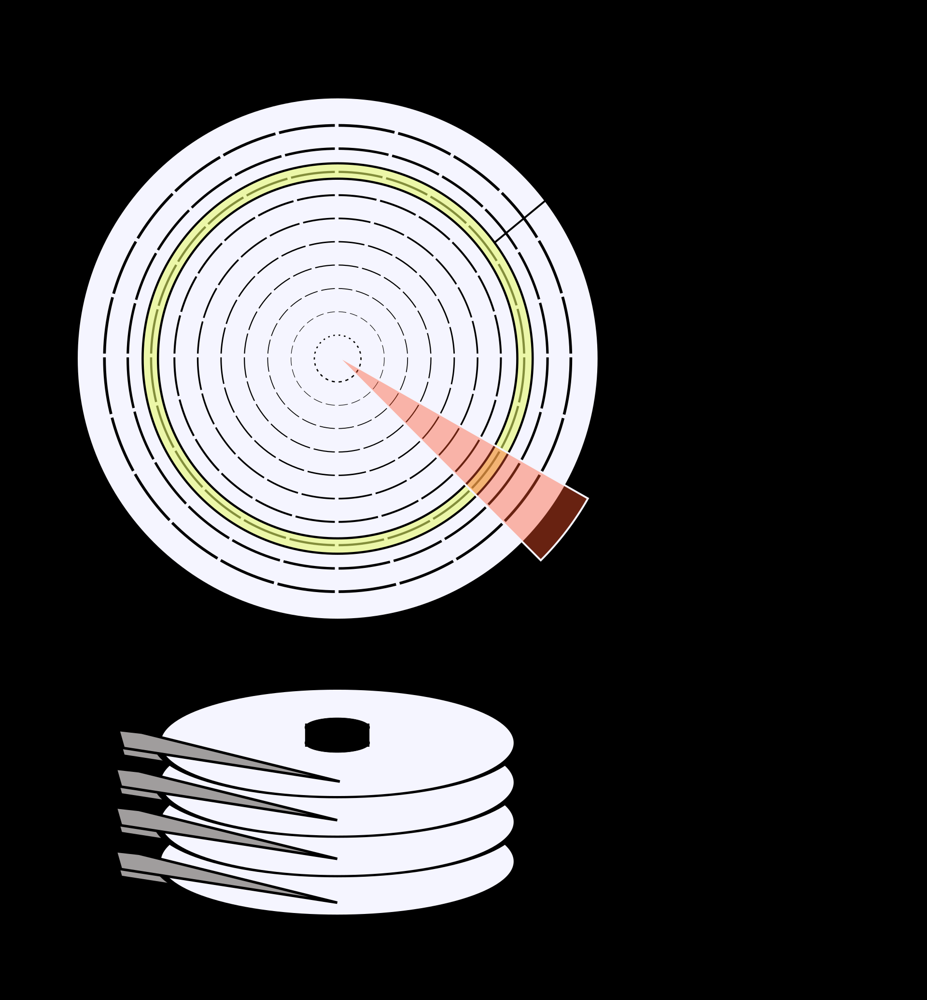

# IO

## IO vs Mem

Common: Both are readable/writable.

Difference: IO is async, while mem is sync.

## DMA & IC

DMA: Direct Memory Access. A feature of computer systems that allows certain hardware subsystems to access main system memory independently of the central processing unit (CPU).

IC: Interrupt Controller. A hardware device that handles interrupts sent on the computer bus by various hardware devices, such as a hard drive controller, a keyboard controller, system timer, or a mouse controller.

## Disk

Cyliner, Header, Sector. (C, H, S)

